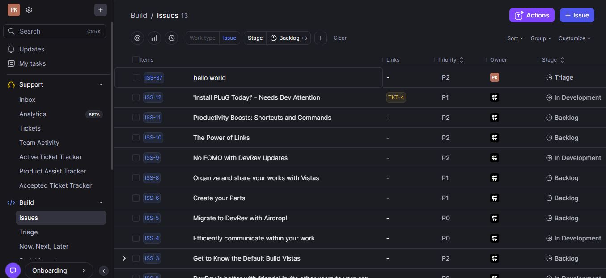
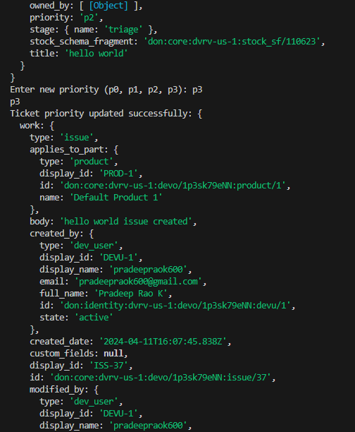
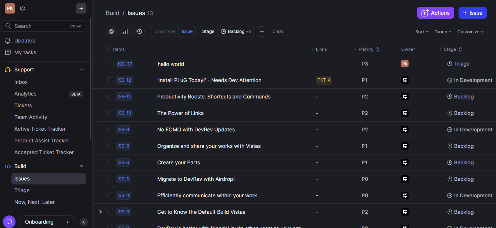

## DevRev Snaps TypeScript Template

This repository contains a template for the functions that can be deployed as
part of Snap-Ins.

### Getting started with the template
1. Create a new repository from this template.
2. In the new repository, you can add functions at path `src/functions` where the folder name corresponds to the function name in your manifest file.
3. Each function you add will also need to be mentioned in `src/function-factory.ts` .

### Testing locally
You can test your code by adding test events under `src/fixtures` similar to the example event provided. You can add keyring values to the event payload to test API calls as well.

Once you have added the event, you can test your code by running:
```
npm install
npm run start:watch -- --functionName=function_1 --fixturePath=function_1_event.json
```

### Adding external dependencies
You can also add dependencies on external packages in package.json under the "dependencies" key. These dependencies will be made available to your function at runtime and testing.

### Packaging the code
Once you are done with the testing,
Run
```
npm install
npm run build
npm run package
```
and ensure it succeeds.

You will see a `build.tar.gz` file is created and you can provide it while creating the snap_in_version.

### Results 
#### Utilizing DevRev API
- Create DevRev account
- Create DevRev organization
- Create PAT
- Use APIs in your application

#### Creation of WorkItem (Issue)




Initially we create a issue with a title and body provided by the user by default the issue has priority of 'p2'.

#### Creating a snap in
- Problem Statement: Priority assignment to newly created issues.





Here, we update the priority of newly created issue from 'p2' to 'p1'.

